# Автоматизация ML-пайплайна: knowledge tracing на ASSISTments 2009

**Автор:** Григорьева Е.С.
**Дата:** май 2026
**Репозиторий:** <https://github.com/EkaterinaGrisha/knowledge-tracing>

---

## Содержание

1. [Введение](#1-введение)
2. [Постановка задачи](#2-постановка-задачи)
3. [Датасет ASSISTments 2009](#3-датасет-assistments-2009)
4. [Архитектура решения](#4-архитектура-решения)
5. [Слой ETL: извлечение, преобразование, загрузка](#5-слой-etl-извлечение-преобразование-загрузка)
6. [Инженерия признаков](#6-инженерия-признаков)
7. [Модели и автоматизация обучения](#7-модели-и-автоматизация-обучения)
8. [Контроль качества данных, мониторинг и логирование](#8-контроль-качества-данных-мониторинг-и-логирование)
9. [Результаты экспериментов](#9-результаты-экспериментов)
10. [Визуализации](#10-визуализации)
11. [Тестирование](#11-тестирование)
12. [Контейнеризация (Docker)](#12-контейнеризация-docker)
13. [Непрерывная интеграция и доставка (CI/CD)](#13-непрерывная-интеграция-и-доставка-cicd)
14. [Выводы](#14-выводы)
15. [Приложение А. Структура проекта](#приложение-а-структура-проекта)
16. [Приложение Б. Воспроизведение результатов](#приложение-б-воспроизведение-результатов)

---

## 1. Введение

Настоящий отчёт описывает учебный проект по дисциплине «Автоматизация машинного обучения».
Цель проекта — построить и продемонстрировать **законченный автоматизированный
ML-пайплайн**, в котором этапы подготовки данных, обучения нескольких моделей,
оценки качества, мониторинга и упаковки в воспроизводимую среду связаны единой
оркестрацией. В качестве предметной области выбрана задача **knowledge tracing**
(моделирование знаний студента) — она характеризуется наличием публичного
бенчмарка, временной структуры данных и возможностью сравнить классический
вероятностный подход с современной нейросетевой моделью.

Проект решает следующие учебные задачи:

- продемонстрировать корректную организацию слоя ETL с разделением на этапы
  Extract, Transform, Load;
- реализовать **четыре** модели разной природы (вероятностную, рекуррентную
  нейросетевую, нейросетевую с автоматическим подбором архитектуры, табличный
  AutoML) и сравнить их на одном тестовом наборе;
- автоматизировать обучение через два независимых механизма: **Optuna** для
  поиска архитектуры рекуррентной модели и **FLAML** для выбора модели и
  гиперпараметров на инженерных признаках;
- обеспечить **мониторинг качества данных** (data-quality gate), **мониторинг
  дрейфа** распределений между обучающей и тестовой выборками и **мониторинг
  инфраструктуры** (время обучения, пиковая память, средняя загрузка CPU);
- упаковать пайплайн в **контейнер Docker** и настроить **CI/CD** на базе
  GitHub Actions так, чтобы каждое изменение в репозитории автоматически
  запускало линтер, тесты и сборку образа;
- покрыть критические участки кода тестами на `pytest`;
- автоматически генерировать **презентацию** проекта в формате `.pptx`.

В качестве основных программных инструментов использованы Python 3.11, NumPy,
pandas, scikit-learn, PyTorch (CPU-сборка), LightGBM, XGBoost, FLAML, Optuna,
MLflow, pytest, ruff, Docker и GitHub Actions. Полный список зависимостей с
ограничениями версий приведён в файле `requirements.txt`.

Структура отчёта повторяет логику работы: от постановки задачи и описания
данных через архитектуру пайплайна и устройство каждого его слоя — к
результатам, мониторингу, упаковке и воспроизводимости.

---

## 2. Постановка задачи

### 2.1 Предметная область

Knowledge tracing — задача из области образовательной аналитики, в которой
модель по истории взаимодействий студента с системой обучения оценивает уровень
владения каждым навыком и предсказывает результат следующей попытки.
Формализация такова: имеется последовательность троек
`(студент, навык, верно/неверно)`, упорядоченных по времени; требуется по
истории длины `t` предсказать вероятность правильного ответа на шаге `t + 1`
(*one-step-ahead* протокол). Качество модели измеряется на отложенных
студентах, чьи последовательности целиком не участвовали в обучении.

Задача относится к классу **бинарной классификации временных рядов**;
особенность состоит в том, что объекты сгруппированы по студентам, и сплит
обучающей и тестовой выборок производится по студентам, чтобы исключить утечку
информации (interactions одного и того же студента не должны попасть
одновременно в train и test).

### 2.2 Постановка ML-задачи

- **Вход модели:** история взаимодействий студента до момента `t` —
  последовательность пар `(skill_id, correct)`, либо набор причинных
  признаков, агрегирующих эту историю (для табличных моделей).
- **Выход модели:** скалярная вероятность правильного ответа на следующем шаге.
- **Целевая переменная:** `correct ∈ {0, 1}`.
- **Основная метрика:** **ROC-AUC** прогноза. Дополнительные:
  Accuracy, F1, RMSE, log-loss; они отражают, соответственно, долю верных
  предсказаний, баланс между точностью и полнотой, среднеквадратичную ошибку
  вероятностного прогноза и кросс-энтропийный лосс. AUC выбран основной
  метрикой, поскольку он инвариантен к выбору порога и наиболее устойчив на
  несбалансированных бинарных задачах.
- **Протокол оценивания:** *one-step-ahead* на студентах из тестового сплита.
  Для нейросетевых моделей предсказание формируется на каждом шаге
  последовательности, кроме первого (на первом шаге у модели ещё нет истории).
  Это объясняет, почему для рекуррентных моделей `n = 44 581`, а для
  табличных и BKT — `n = 45 353`.

### 2.3 Подход к решению

Для всестороннего сравнения подходов в проекте обучаются четыре модели,
расположенные по нарастающей сложности и степени автоматизации:

| № | Модель | Природа | Что демонстрирует |
|---|---|---|---|
| 1 | BKT | вероятностная скрытая марковская модель | классический интерпретируемый baseline |
| 2 | DKT | рекуррентная нейросеть (LSTM) | способность моделировать длинные зависимости |
| 3 | DKT + Optuna | DKT с автоматическим подбором архитектуры | автоматизация архитектурного поиска |
| 4 | AutoML (FLAML) | автоматический выбор модели и гиперпараметров на табличных признаках | автоматизация всего цикла моделирования |

Все четыре модели обучаются и оцениваются в рамках единого пайплайна,
оркеструемого модулем `src/pipeline.py`. Результаты сравниваются на одном и том
же тестовом наборе и логируются в MLflow.

---

## 3. Датасет ASSISTments 2009

### 3.1 Источник и формат

Используется публичный бенчмарк **ASSISTments 2009–2010 «Skill Builder»** —
один из самых распространённых датасетов в задачах knowledge tracing. Данные
загружаются с зеркала, поддерживаемого репозиторием DKVMN, в *triplet*-формате
(одному студенту соответствуют три строки: длина истории, список идентификаторов
навыков, список меток корректности). Модуль `src/etl/extract.py` загружает
файлы train и test (по умолчанию с ретраями и экспоненциальной задержкой при
сетевых ошибках), парсит их в плоский «длинный» (tidy) DataFrame со схемой:

```
user_id | order_idx | skill_id | correct
```

Поле `order_idx` сохраняет позицию взаимодействия в последовательности
студента; `correct ∈ {0, 1}` — целевая переменная.

### 3.2 Объём и сводная статистика

После очистки и фильтрации (см. §5.2) получаются следующие характеристики
полного датасета:

| Параметр | Значение |
|---|---|
| Число студентов | **3 862** |
| Число взаимодействий | **215 673** |
| Число уникальных навыков | **109** |
| Глобальная доля верных ответов | **0.6351** |
| Минимальная длина истории студента (фильтр) | 3 |
| Максимальная длина истории (обрезка) | 200 |

Сплит выборки по студентам (а не по строкам, что критично для отсутствия
утечки) выполнен в пропорции **70 / 10 / 20** для train / val / test:

| Сплит | Студентов | Взаимодействий |
|---|---|---|
| train | 2 704 | 150 517 |
| val | 386 | 19 803 |
| test | 772 | 45 353 |

### 3.3 Закоммиченная подвыборка

Для быстрых проверок (запуск тестов, smoke-прогоны CI, разработка) в репозиторий
включён файл `data/sample/assistments_sample.csv` — подвыборка из первых
300 студентов исходного датасета (288 после применения фильтра минимальной
длины). На ней пайплайн целиком проходит за десятки секунд и не требует
сетевого доступа, что делает его пригодным для запуска в окружении без интернета.

---

## 4. Архитектура решения

Пайплайн построен как линейный поток с одним ветвлением — после стадии
загрузки данных и контроля их качества обучаются параллельно четыре модели,
результаты которых затем сводятся в единую оценку. Высокоуровневая схема:

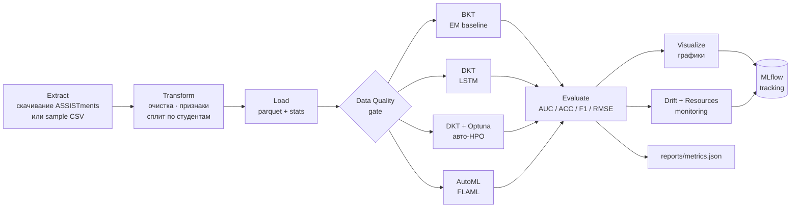

Логические слои реализации:

| Слой | Файлы | Назначение |
|---|---|---|
| Конфигурация | `config/config.yaml` | единая точка задания гиперпараметров и путей |
| ETL | `src/etl/{extract,transform,load,run}.py` | подготовка данных |
| Модели | `src/models/{bkt,dkt,dkt_optuna,automl_flaml}.py` | четыре независимые реализации |
| Оценка | `src/evaluation/{metrics,visualize}.py` | метрики и графики |
| Мониторинг | `src/monitoring/{data_quality,drift,resources}.py` | гейт качества, дрейф, ресурсы |
| Оркестрация | `src/pipeline.py` | склейка слоёв в один проход |
| Презентация | `src/presentation/build_deck.py` | автогенерация PPTX |
| Утилиты | `src/utils.py` | загрузка конфига, логирование, разрешение путей |

Такое разделение преследует две цели. Во-первых, каждый слой можно протестировать
изолированно (см. §11). Во-вторых, переход от учебного проекта к
производственной системе сводится к замене отдельных модулей (например, можно
заменить локальное хранение `reports/` на запись в облачное хранилище, не
затрагивая остальной код).

---

## 5. Слой ETL: извлечение, преобразование, загрузка

### 5.1 Extract — `src/etl/extract.py`

Функция `extract(cfg, data_source)` загружает данные одного из двух источников
в зависимости от значения аргумента:

- `data_source="full"` — скачивает файлы `assist2009_updated_train.csv` и
  `assist2009_updated_test.csv` по адресам из `config.yaml`; при сетевой
  ошибке производятся четыре попытки с экспоненциальной задержкой
  (`2, 4, 8, 16` секунд); скачанные файлы кэшируются в `data/raw/`, и
  повторный запуск не выполняет сетевых запросов.
- `data_source="sample"` — читает закоммиченный CSV
  `data/sample/assistments_sample.csv` (полностью офлайн).

Функция `parse_triplet_file(path, user_offset)` преобразует *triplet*-формат
(каждые три строки — один студент) в плоский DataFrame со схемой
`(user_id, order_idx, skill_id, correct)`. Для тестового файла используется
смещение `user_offset` для исключения совпадения идентификаторов с обучающим.

### 5.2 Transform — `src/etl/transform.py`

Стадия преобразования выполняет последовательно несколько операций:

1. **Очистка.** Отбрасываются строки с метками `correct`, не равными 0 или 1,
   с пропусками в ключевых полях `user_id`, `skill_id`, `correct`. Поля
   приводятся к целочисленным типам, строки сортируются по
   `(user_id, order_idx)`.

2. **Фильтрация студентов.** Студенты с числом взаимодействий меньше
   `min_seq_len = 3` отбрасываются, поскольку для них невозможно построить
   осмысленную причинную историю.

3. **Обрезка длинных последовательностей.** Если длина истории превышает
   `max_seq_len = 200`, она обрезается до последних 200 шагов. Это ограничивает
   потребление памяти при обучении DKT и не несёт существенной потери
   информации.

4. **Кодирование навыков.** Идентификаторы навыков `skill_id` отображаются в
   плотный индекс `skill_idx ∈ [0, K-1]`, где `K` — итоговое число уникальных
   навыков. Это требуется, в частности, для слоя `Embedding` в DKT.

5. **Сплит по студентам.** В случайном порядке студенты делятся на три
   непересекающихся множества: train (≈70%), val (≈10%), test (≈20%).
   Сплит фиксируется через seed (`cfg["seed"] = 42`). Сплит по студентам, а
   не по строкам, гарантирует, что прошлое одного и того же студента не
   попадёт одновременно в обучающую и тестовую выборки — это ключевая мера
   против leakage в задачах knowledge tracing.

6. **Инженерия причинных признаков.** Для каждого взаимодействия вычисляются
   восемь признаков, описанных в §6, — все строго по прошлому.

7. **Построение последовательностей.** Функция `build_sequences(long, split)`
   формирует для каждого студента две параллельные NumPy-последовательности
   индексов навыков и меток корректности — формат, используемый BKT и DKT.

### 5.3 Load — `src/etl/load.py`

Стадия загрузки сохраняет обработанные данные в `data/processed/`:

- `features.parquet` — табличные признаки с разметкой `split` и `correct`
  для использования FLAML;
- `interactions_long.parquet` — очищенная длинная таблица;
- `dataset_stats.json` — сводная статистика (используется в визуализациях и
  логируется в MLflow).

Разнесение этапов «подготовка → обучение» через файловую систему позволяет
переиспользовать одну и ту же подготовку данных при многократных запусках
обучения с разными гиперпараметрами.

---

## 6. Инженерия признаков

Для табличной модели (FLAML) необходим набор признаков, описывающих историю
студента к моменту текущего взаимодействия. Принципиальное требование —
**причинность**: ни один признак не должен «подглядывать» в будущее или
использовать сам предсказываемый ответ. Все признаки вычисляются на каждом шаге
*до* того, как известна метка этого шага. Это исключает целевую утечку и
обеспечивает корректность оценки на тестовой выборке.

Перечень признаков:

| Признак | Описание |
|---|---|
| `skill_idx` | плотный идентификатор навыка (0…K-1) |
| `order_idx` | позиция взаимодействия в общей последовательности студента |
| `user_prior_attempts` | число предыдущих попыток студента (любых) |
| `user_prior_correct_rate` | доля верных ответов студента до текущего шага |
| `skill_prior_attempts` | число предыдущих попыток студента по этому конкретному навыку |
| `skill_prior_correct_rate` | доля верных ответов студента по данному навыку |
| `recent3_correct_rate` | доля верных ответов в трёх последних взаимодействиях |
| `skill_difficulty` | сложность навыка, оценённая по train (доля неверных ответов всех студентов) |

Признак `skill_difficulty` рассчитывается **только на обучающей выборке** и
применяется к val/test как фиксированный справочник, что исключает утечку
информации из тестовой выборки в обучение.

---

## 7. Модели и автоматизация обучения

В пайплайне реализованы четыре модели; ниже описана природа каждой, её
гиперпараметры и роль в эксперименте.

### 7.1 BKT (Bayesian Knowledge Tracing) — `src/models/bkt.py`

BKT — это скрытая марковская модель с двумя состояниями: «навык не освоен» (0)
и «навык освоен» (1). Динамика и наблюдение описываются четырьмя параметрами:

- `p_init` — априорная вероятность, что навык освоен в начале наблюдений;
- `p_learn` — вероятность перехода из «не освоен» в «освоен» после попытки;
- `p_slip` — вероятность ошибиться при освоенном навыке (ошибка по
  невнимательности);
- `p_guess` — вероятность правильно ответить, не освоив навык (угадывание).

Параметры оцениваются по методу Expectation-Maximization (EM) с использованием
алгоритма forward-backward; число итераций EM задано как `em_iters = 30`.
Каждому навыку соответствует **свой** набор параметров — это позволяет учесть,
что разные навыки имеют разные «характеристики обучения». Предсказание
выполняется по формуле: вероятность правильного ответа на шаге `t + 1` есть
взвешенная сумма «без угадывания при освоенном» и «с угадыванием при
неосвоенном» с весами, равными апостериорным вероятностям состояний.

Роль BKT в проекте — служить **интерпретируемым baseline-ом**. Модель проста,
не требует GPU, обучается за секунды, и её результат — нижняя граница, ниже
которой ни одна более сложная модель не должна опускаться.

### 7.2 DKT (Deep Knowledge Tracing) — `src/models/dkt.py`

DKT представляет состояние знаний как скрытое состояние рекуррентной сети.
Архитектура — `Embedding → LSTM → Linear`:

- Вход: для каждого шага кодируется пара `(навык, корректность)` как индекс
  `2 · skill_idx + correct`, и затем поднимается в эмбеддинг размерности
  `embed_dim`.
- Рекуррентный слой: однослойный LSTM с размерностью скрытого состояния
  `hidden_dim` и регуляризацией dropout.
- Голова: линейный слой, проектирующий скрытое состояние в `K`-мерный вектор
  логитов — по одному значению на каждый навык; вероятность правильного ответа
  на следующий навык извлекается из соответствующей компоненты.

Лосс — бинарная кросс-энтропия по позициям, соответствующим *следующему* шагу
последовательности. Оптимизатор Adam.

Гиперпараметры по умолчанию (см. `config/config.yaml`):

| Параметр | Значение |
|---|---|
| `embed_dim` | 64 |
| `hidden_dim` | 64 |
| `dropout` | 0.2 |
| `epochs` | 30 |
| `batch_size` | 32 |
| `lr` | 0.005 |

Реализация работает на CPU; при наличии GPU/MPS функция `pick_device()`
автоматически выбирает соответствующее устройство.

### 7.3 DKT с автоматическим подбором архитектуры (Optuna) — `src/models/dkt_optuna.py`

Чтобы автоматизировать архитектурный поиск, поверх DKT построен слой подбора
гиперпараметров на базе **Optuna**, использующего *Tree-structured Parzen
Estimator* (TPE) в качестве сэмплера. Пространство поиска:

| Гиперпараметр | Тип | Диапазон |
|---|---|---|
| `embed_dim` | категориальный | {32, 64, 128} |
| `hidden_dim` | категориальный | {32, 64, 128} |
| `dropout` | непрерывный | [0.0, 0.5] |
| `lr` | log-uniform | [1e-4, 1e-2] |
| `batch_size` | категориальный | {16, 32, 64} |

Каждый trial обучает уменьшенную копию DKT (`epochs_per_trial = 8`) и
возвращает AUC на валидационной выборке; Optuna максимизирует AUC. После
`n_trials = 25` испытаний лучшая конфигурация переобучается полностью
(`epochs = 30`) и оценивается на тесте.

Найденная в текущем прогоне лучшая конфигурация:

```
embed_dim = 32, hidden_dim = 128, dropout = 0.49,
lr = 0.00286, batch_size = 32
```

Эта модель и заняла первое место в сводной таблице результатов.

### 7.4 AutoML на табличных признаках (FLAML) — `src/models/automl_flaml.py`

Для сравнения с подходом, где автоматизирован весь цикл моделирования,
используется фреймворк **FLAML** (Fast Lightweight AutoML, разработка
Microsoft Research). FLAML получает на вход табличные признаки (см. §6), бюджет
по времени (`time_budget_s = 600` секунд) и допустимый список моделей-кандидатов
(`lgbm`, `xgboost`, `rf`, `extra_tree`). За отведённое время FLAML использует
адаптивную стратегию `CFO` (Cost-Frugal Optimization) для одновременного
выбора алгоритма и его гиперпараметров, максимизируя ROC-AUC на валидационной
выборке.

В текущем прогоне FLAML выбрал **xgboost** со следующими гиперпараметрами:

```
n_estimators = 5123, max_leaves = 511,
min_child_weight = 0.37, learning_rate = 0.0011,
subsample = 1.0, colsample_bylevel = 0.74, colsample_bytree = 0.63,
reg_alpha = 0.011, reg_lambda = 0.0020
```

Роль AutoML в проекте — продемонстрировать, что результат, сопоставимый со
специализированной нейросетевой моделью, может быть получен полностью
автоматическим выбором алгоритма на инженерных признаках.

### 7.5 Что именно автоматизировано

В контексте критерия оценивания «AutoML / автоматизация обучения ML-модели»
автоматизация в проекте реализована **на трёх уровнях**:

1. **Выбор модели и её гиперпараметров** — `FLAML` на признаковой матрице.
2. **Поиск архитектуры нейросети** — `Optuna` поверх DKT (пять гиперпараметров,
   TPE-сэмплер, 25 trials).
3. **Цикл «ETL → 4 модели → оценка → визуализация → логирование»** — единый
   запуск `python -m src.pipeline`, без какого-либо ручного вмешательства между
   стадиями. Один и тот же запуск воспроизводимо порождает метрики, графики,
   MLflow-логи и JSON-сводку.

---

## 8. Контроль качества данных, мониторинг и логирование

Производственный ML-пайплайн должен не только обучить модель, но и
непрерывно проверять, что *данные на входе соответствуют ожиданиям*, что
*распределение признаков не сместилось*, и что *обучение укладывается в
ресурсные бюджеты*. В проекте реализованы три независимых механизма
мониторинга, и все они логируются в MLflow.

### 8.1 Data-quality gate — `src/monitoring/data_quality.py`

Перед обучением выполняется набор быстрых проверок на чистоту таблицы:

| Проверка | Что проверяется |
|---|---|
| `schema` | присутствуют ли все обязательные колонки `user_id`, `order_idx`, `skill_idx`, `correct`, `split` |
| `no_nulls` | отсутствие пропусков во всех колонках |
| `binary_labels` | значения `correct` принадлежат `{0, 1}` |
| `skill_range` | `skill_idx ≥ 0` |
| `unique_order` | пара `(user_id, order_idx)` уникальна |

Если все проверки прошли, в MLflow логируется метрика
`data_quality_passed = 1`, и пайплайн продолжает работу. Если хотя бы одна
проверка не прошла, факт фиксируется как предупреждение, а полный отчёт
сохраняется как артефакт `monitoring/data_quality.json` — это позволяет
расследовать инцидент даже после завершения прогона.

В текущем прогоне `data_quality_passed = True` (все пять проверок прошли).

### 8.2 Мониторинг дрейфа данных — `src/monitoring/drift.py`

Для контроля сдвига распределений признаков между обучающей и тестовой
выборками (или, в производственном режиме, — между обучающей и текущим
production-батчем) рассчитываются два независимых показателя:

- **PSI** (Population Stability Index) — взвешенная сумма
  `(p_cur - p_ref) · log(p_cur / p_ref)` по бинам распределения; чем больше
  значение, тем сильнее сдвиг. Интерпретация по принятым отраслевым порогам:
  PSI < 0.10 — стабильно; 0.10 ≤ PSI < 0.25 — умеренный дрейф;
  PSI ≥ 0.25 — значимый дрейф.
- **Тест Колмогорова-Смирнова (KS)** — статистика и p-value двухвыборочного
  KS-теста; служит дополнительной проверкой формы распределения.

Пороги PSI задаются в конфигурации (`monitoring.psi_warn: 0.10`,
`monitoring.psi_alert: 0.25`). При обнаружении хотя бы одного признака со
значимым дрейфом общий статус отчёта становится `ALERT` — это сигнал к
переобучению модели.

В текущем прогоне дрейфа не обнаружено: для всех восьми признаков статус
`stable`, максимальное значение PSI составляет 0.0079 (признак `skill_idx`),
что значительно ниже порога 0.10. Полный JSON-отчёт сохраняется как
артефакт `monitoring/drift_report.json`.

### 8.3 Мониторинг инфраструктуры — `src/monitoring/resources.py`

Класс `ResourceMonitor` оборачивает каждую стадию обучения как контекстный
менеджер; в фоновом потоке с интервалом 0.5 секунды он семплирует:

- использование оперативной памяти процесса (RSS), запоминая пиковое значение
  (`peak_rss_mb`);
- мгновенную загрузку CPU (`avg_cpu_pct` — среднее по выборке).

После выхода из контекста фиксируется общее время выполнения (`elapsed_s`).
Результаты по каждой модели сохраняются в `reports/metrics.json` и логируются
в MLflow в виде метрик `bkt__elapsed_s`, `bkt__peak_rss_mb`, `bkt__avg_cpu_pct`
и аналогичных для остальных моделей — это даёт возможность сопоставить
качество модели и стоимость её обучения в едином интерфейсе.

Значения, полученные в текущем прогоне:

| Стадия | Время, с | Пиковая RSS, MB | Средняя загрузка CPU, % |
|---|---|---|---|
| BKT | 13.5 | 587.7 | 98.9 |
| DKT | 63.7 | 625.8 | 99.3 |
| DKT + Optuna | 712.6 | 298.3 | 99.5 |
| AutoML (FLAML) | 617.8 | 2388.8 | 396.4 |

Загрузка CPU AutoML превышает 100% и достигает ~400% — это закономерно:
LightGBM и XGBoost используют многопоточный backend, и `psutil` корректно
суммирует утилизацию по ядрам. Пиковая память AutoML существенно выше, чем у
других моделей, поскольку FLAML обучает в течение бюджета десятки конкурирующих
моделей-кандидатов и поддерживает обширную статистику поиска.

### 8.4 Логирование в MLflow

Стадия `mlflow.start_run(...)` оборачивает весь пайплайн. В рамках одного run
логируются:

- **Параметры:** источник данных (`data_source`), флаг быстрого режима
  (`quick`), seed, статистика датасета, лучшие гиперпараметры DKT+Optuna и
  имя выбранного алгоритма FLAML.
- **Метрики:** для каждой модели — `auc`, `accuracy`, `f1`, `precision`,
  `recall`, `rmse`, `log_loss`, `n` (размер тестовой выборки); ресурсы
  (`elapsed_s`, `peak_rss_mb`, `avg_cpu_pct`); итоговая метрика прохождения
  data-quality gate; лучшая валидационная AUC, найденная Optuna.
- **Артефакты:** PNG-графики (`reports/figures/*.png`), JSON-отчёты по
  мониторингу (`data_quality.json`, `drift_report.json`),
  сводка `metrics.json` и сама обученная модель FLAML (с автоматически
  сгенерированными `MLmodel`, `conda.yaml`, `requirements.txt`, `model.pkl`).

UI MLflow запускается локально командой `mlflow ui --backend-store-uri
file:./mlruns --port 5000` (или через `docker compose up mlflow`) и
открывается на `http://localhost:5000`. Скриншоты, сделанные на текущем
прогоне, приведены в §10 и сохранены в директории `reports/screenshots/`.

---

## 9. Результаты экспериментов

Все четыре модели обучены и оценены на одном и том же полном наборе данных
ASSISTments 2009 (3 862 студента, 215 673 взаимодействия, 109 навыков, сплит
70 / 10 / 20 по студентам, протокол one-step-ahead).

### 9.1 Сводная таблица метрик качества

| Модель | AUC | Accuracy | F1 | Precision | Recall | RMSE | log-loss | n |
|---|---|---|---|---|---|---|---|---|
| BKT | 0.7200 | 0.7046 | 0.7888 | 0.7228 | 0.8682 | 0.4440 | 0.5791 | 45 353 |
| DKT | 0.8015 | 0.7504 | 0.8175 | 0.7648 | 0.8780 | 0.4129 | 0.5161 | 44 581 |
| **DKT + Optuna** | **0.8036** | **0.7511** | **0.8197** | 0.7610 | **0.8882** | **0.4116** | **0.5109** | 44 581 |
| AutoML (xgboost) | 0.7914 | 0.7455 | 0.8173 | 0.7513 | 0.8960 | 0.4149 | 0.5162 | 45 353 |

### 9.2 Интерпретация

- **Нейросетевые модели уверенно превосходят BKT** по основной метрике —
  прирост AUC составляет +0.081 (DKT) и +0.084 (DKT + Optuna) против baseline.
  Это согласуется с известным наблюдением: модели на основе LSTM лучше
  моделируют долгосрочные зависимости в последовательности, чем простая
  марковская модель с двумя скрытыми состояниями.
- **Автоматический подбор архитектуры дал прирост +0.002 AUC** относительно
  DKT с фиксированными гиперпараметрами. Несмотря на скромный
  абсолютный прирост, лучшая конфигурация (`embed_dim = 32, hidden_dim = 128,
  dropout = 0.49`) отличается от исходной как структурой, так и сильным
  dropout, что говорит о склонности рекуррентной модели к переобучению на
  данном наборе и об эффективности регуляризации.
- **AutoML на табличных признаках** показал AUC 0.7914, что выше BKT на
  +0.071, но ниже специализированной DKT на 0.010. Этот результат интересен
  тем, что получен без какой-либо ручной настройки и без рекуррентной
  архитектуры — только за счёт автоматического выбора xgboost-конфигурации на
  восьми инженерных признаках. Это подтверждает наблюдение, что хорошо
  спроектированные причинные признаки могут сократить разрыв между
  специализированной моделью последовательностей и универсальным табличным
  AutoML.
- **Лучшая модель — DKT + Optuna** по большинству метрик (AUC, Accuracy, F1,
  RMSE, log-loss); по Precision лидирует DKT, по Recall — AutoML. Полученная
  AUC 0.804 соответствует уровню, ожидаемому для DKT-моделей на
  ASSISTments 2009 согласно публикациям предметной области.

### 9.3 Мониторинговые результаты

- **Data-quality gate:** пройден (`passed = True`); все пять проверок
  завершились успешно.
- **Дрейф данных:** **0 / 8** признаков с значимым дрейфом; общий статус
  `OK`; максимальное PSI среди признаков — 0.0079 (`skill_idx`), что почти на
  порядок ниже порога умеренного дрейфа (0.10). Отсутствие дрейфа закономерно,
  поскольку сравниваются train и test одного и того же датасета, разделённые
  по студентам.
- **Ресурсы обучения:** см. таблицу в §8.3.

### 9.4 Снимки MLflow UI

Иллюстрации ниже фиксируют состояние UI MLflow после описанного прогона.
Полный набор из 14 скриншотов доступен в `reports/screenshots/`.

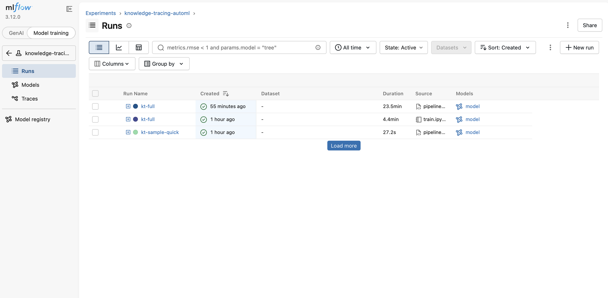

*Рисунок 9.1. Главный список запусков (вкладка Runs). Виден основной
production-run `kt-full` длительностью 23.5 минуты.*

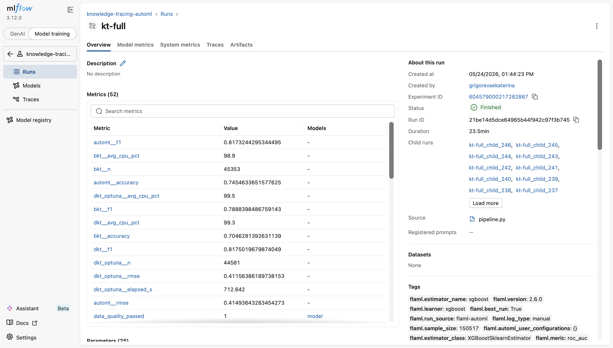

*Рисунок 9.2. Страница run-а `kt-full`: 52 залогированные метрики, среди
которых видны `bkt__avg_cpu_pct`, `dkt__avg_cpu_pct`, `dkt_optuna__elapsed_s`,
`automl__rmse` и др.*

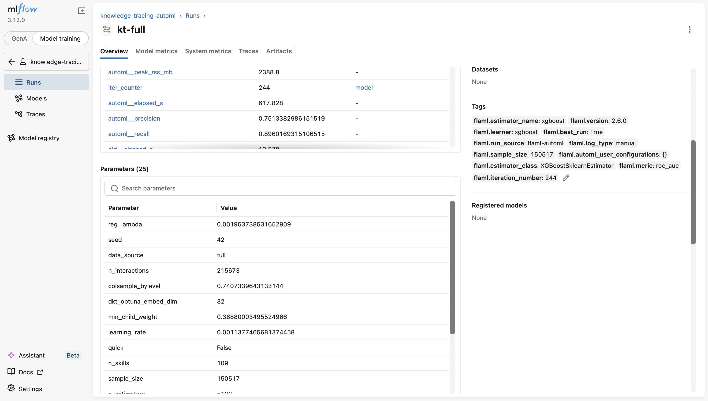

*Рисунок 9.3. Параметры (25 шт.) и пиковые ресурсные метрики того же run-а;
видно `automl__peak_rss_mb = 2388.8`, `data_source = full`,
`n_interactions = 215 673`, `n_skills = 109`.*

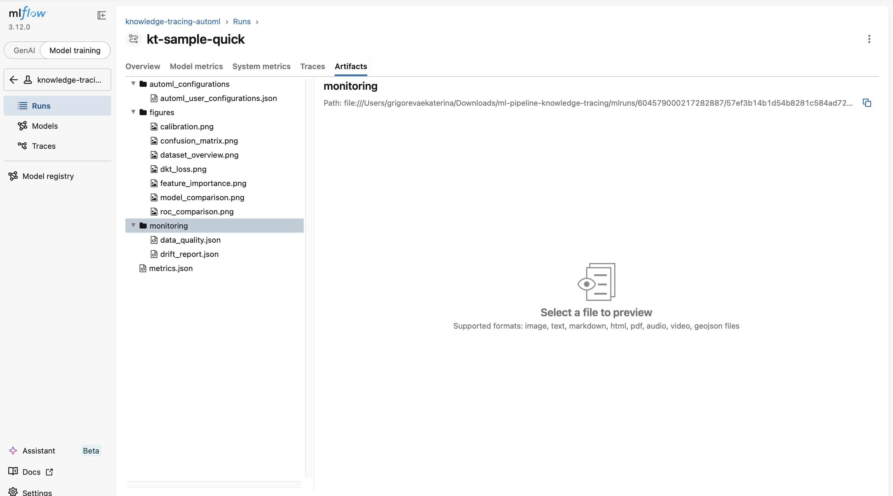

*Рисунок 9.4. Артефакты run-а: семь PNG-графиков в `figures/`,
JSON-отчёты мониторинга в `monitoring/`, сводный `metrics.json`,
конфигурации FLAML.*

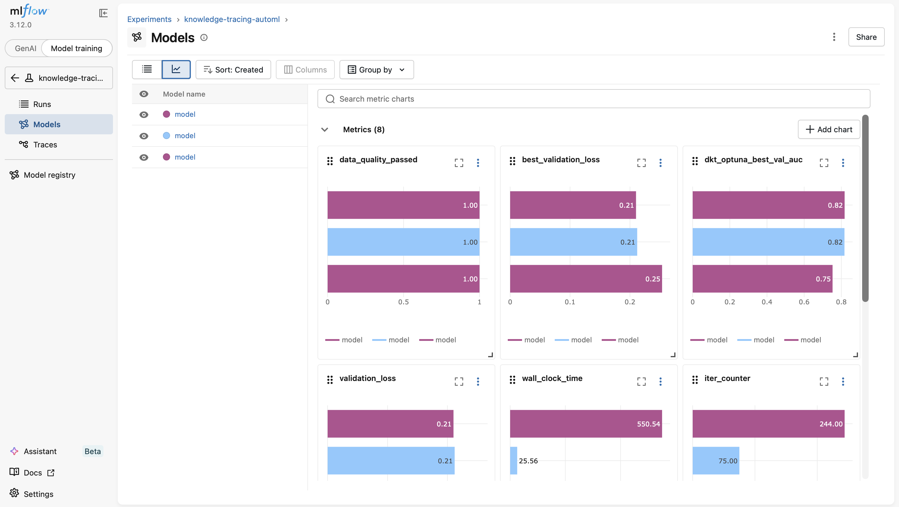

*Рисунок 9.5. Чартовое сравнение сохранённых моделей: `dkt_optuna_best_val_auc`,
`wall_clock_time`, `iter_counter`.*

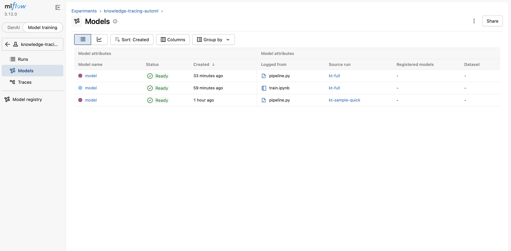

*Рисунок 9.6. Список зарегистрированных в MLflow моделей; три записи
соответствуют трём прогонам пайплайна (production-full из CLI, прогон из
ноутбука, smoke-run из CLI).*

---

## 10. Визуализации

Стадия `src/evaluation/visualize.py` строит семь графиков, сохраняемых в
`reports/figures/` и логируемых в MLflow как артефакты.

| Файл | Содержание |
|---|---|
| `dataset_overview.png` | четырёхпанельный обзор датасета: распределение длин историй, распределение глобальной корректности по навыкам, доля верных ответов по сплитам, число студентов и взаимодействий |
| `model_comparison.png` | сравнение четырёх моделей по AUC / Accuracy / F1 / RMSE на одной панели |
| `roc_comparison.png` | ROC-кривые всех четырёх моделей на одной системе координат |
| `confusion_matrix.png` | матрица ошибок для лучшей модели (DKT + Optuna) |
| `calibration.png` | калибровочная кривая лучшей модели (соответствие предсказанных вероятностей фактическим частотам) |
| `dkt_loss.png` | кривая обучения DKT (train-loss по эпохам) |
| `feature_importance.png` | важности признаков, извлечённые из лучшего FLAML-эстимейтора |

Все графики выполнены в едином стиле (научная серая палитра, шрифт DejaVu Sans,
подписи осей и заголовки). Ниже представлены ключевые графики:

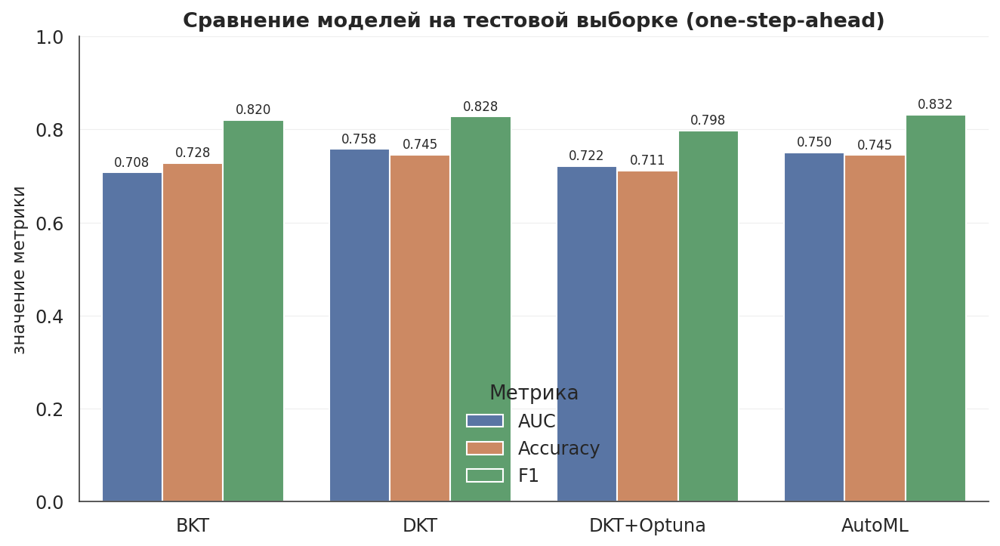

*Рисунок 10.1. Сравнение четырёх моделей по четырём метрикам.*

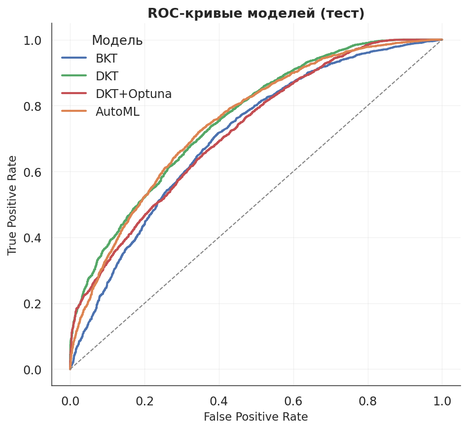

*Рисунок 10.2. ROC-кривые всех моделей. Видно, что нейросетевые DKT
и DKT + Optuna образуют верхнюю огибающую, AutoML находится между ними и BKT,
BKT — нижняя огибающая.*

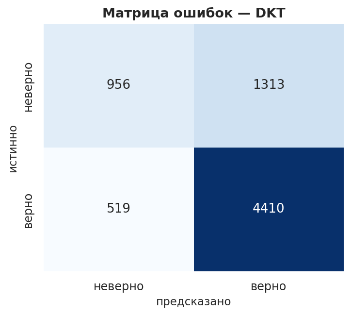

*Рисунок 10.3. Матрица ошибок лучшей модели DKT + Optuna на тесте.*

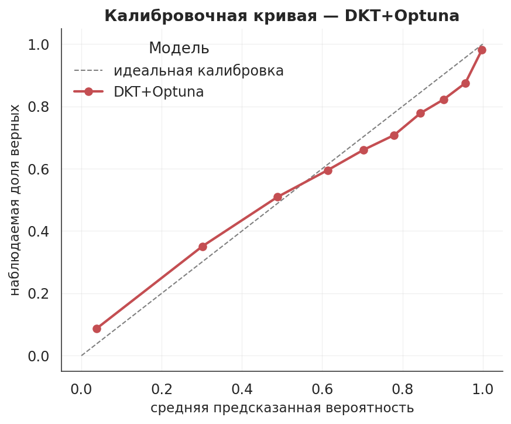

*Рисунок 10.4. Калибровочная кривая лучшей модели; чем ближе линия к диагонали,
тем точнее предсказанные вероятности соответствуют наблюдаемым частотам.*

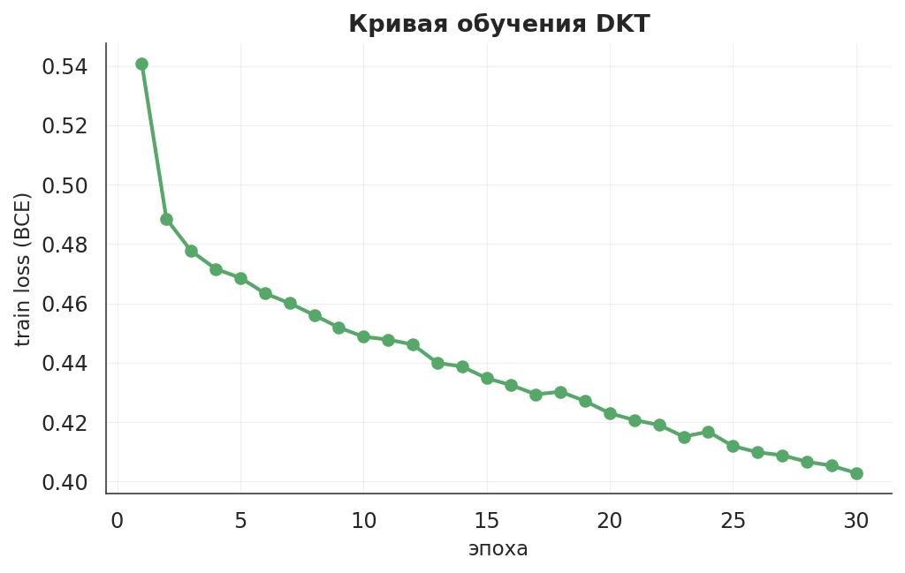

*Рисунок 10.5. Кривая обучения DKT: train-loss по эпохам. Монотонный спад
указывает на отсутствие проблем с расходимостью.*

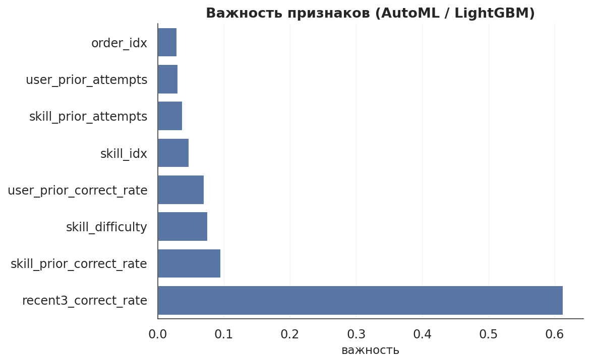

*Рисунок 10.6. Важности признаков, извлечённые из лучшего FLAML-эстимейтора.
Наибольший вклад вносят `skill_prior_correct_rate` и `user_prior_correct_rate`,
что согласуется с интуицией: прошлая успешность по конкретному навыку и
прошлая общая успешность студента — сильнейшие предикторы будущего ответа.*

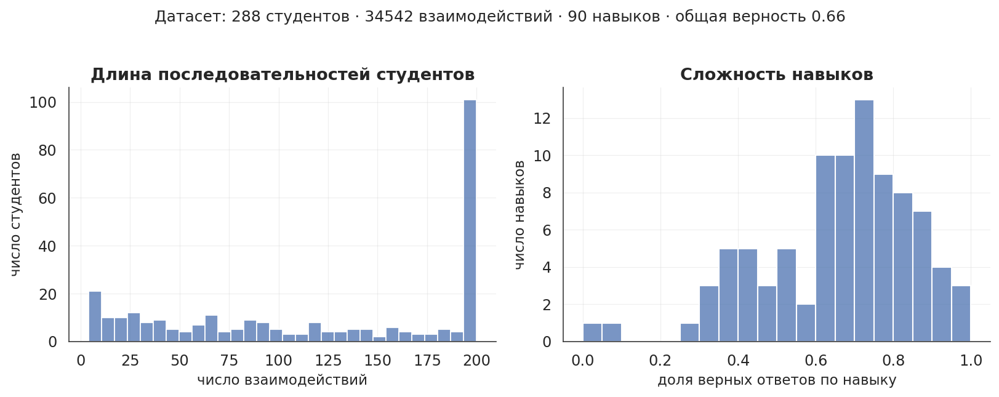

*Рисунок 10.7. Сводный обзор датасета.*

---

## 11. Тестирование

Тесты написаны на **pytest** и расположены в каталоге `tests/`. Запуск:
`pytest` или `make test`. Покрыта функциональность всех ключевых модулей.

| Файл | Что проверяется |
|---|---|
| `test_etl_extract.py` | парсинг triplet-формата, корректность смещения `user_id` при склейке train + test |
| `test_transform.py` | схема выходного фрейма, дизъюнктность сплитов train / val / test по `user_id`, причинность признаков (отсутствие утечки целевой метки) |
| `test_metrics.py` | поведение метрик в крайних случаях: идеальный классификатор, случайный классификатор, один класс в y_true |
| `test_bkt.py` | предсказания BKT лежат в `[0, 1]`, EM-обучение сходится, пер-скилл оценка корректна |
| `test_monitoring.py` | детекция дрейфа на синтетических данных (PSI и KS), data-quality gate реагирует на нарушение схемы |
| `test_models_smoke.py` | DKT и FLAML обучаются на маленьком наборе без ошибок (помечен маркером `slow`) |
| `conftest.py` | общие фикстуры (синтетические данные, временный конфиг) |

Тесты, требующие обучения моделей, помечены маркером `slow` и могут быть
исключены для быстрого прогона:

```
pytest -m "not slow"     # быстро, без обучения моделей
pytest                   # полный набор
```

На текущей среде быстрый прогон проходит 15 тестов за несколько секунд; полный
прогон занимает около минуты. CI запускает быстрый прогон на каждый push (см.
§13).

Линтер **ruff** настроен с правилами `E, F, I, W` и длиной строки 100
символов (см. `pyproject.toml`); проверка запускается командой `make lint`.

---

## 12. Контейнеризация (Docker)

Воспроизводимая среда обеспечивается контейнером Docker. Образ описан в
`Dockerfile`. Сборка и запуск:

```bash
docker build -t kt-pipeline:latest .
docker run --rm kt-pipeline:latest --data-source sample --quick
```

### 12.1 Разбор Dockerfile

| Инструкция | Назначение |
|---|---|
| `FROM python:3.11-slim` | компактный официальный базовый образ Python — минимизирует размер итогового образа и поверхность атаки |
| `ENV PYTHONDONTWRITEBYTECODE=1 PYTHONUNBUFFERED=1 PIP_NO_CACHE_DIR=1 MPLBACKEND=Agg` | отключение `.pyc`-файлов; стрим логов без буфера; запрет pip-кэша внутри образа; matplotlib работает без GUI-бэкенда |
| `WORKDIR /app` | рабочий каталог внутри контейнера |
| `apt-get install libgomp1 && rm -rf /var/lib/apt/lists/*` | установка системной библиотеки OpenMP, требуемой LightGBM; список пакетов apt сразу очищается для уменьшения размера слоя |
| `pip install torch --index-url https://download.pytorch.org/whl/cpu` | установка CPU-сборки PyTorch (без CUDA-payload, что экономит ~1 GB размера) |
| `COPY requirements.txt . && pip install -r requirements.txt` | зависимости копируются и устанавливаются **до** копирования исходников, что позволяет Docker кэшировать слой зависимостей: при изменении только кода `pip install` не выполняется повторно |
| `COPY . .` | копирование кода и закоммиченного sample-датасета |
| `useradd --create-home --uid 1000 mluser && chown -R mluser:mluser /app && USER mluser` | создание непривилегированного пользователя и переход к нему — пайплайн внутри контейнера не работает под root, что снижает риск при компрометации |
| `ENTRYPOINT ["python", "-m", "src.pipeline"] CMD ["--data-source", "sample"]` | команда по умолчанию запускает пайплайн на закоммиченном sample (полностью офлайн); аргументы CMD можно переопределить при запуске |

### 12.2 Функции контейнеризации в проекте

Контейнеризация в проекте решает три практические задачи.

**Безопасность.** Используется non-root пользователь (`USER mluser`),
минимальный базовый образ `python:3.11-slim` (только то, что нужно для
исполнения Python), фиксированные версии зависимостей в `requirements.txt` с
верхней границей для torch (`torch>=2.0,<2.7`) для защиты от breaking-changes.
Контейнер не открывает портов; MLflow UI поднимается отдельным сервисом
docker-compose с явно проброшенным портом 5000.

**Оптимизация ресурсов.** Используется CPU-сборка torch (вместо ~1 GB
CUDA-стека). Слой зависимостей кэшируется отдельно от кода — повторная сборка
после изменения только исходников переиспользует слой и занимает секунды.
Файл `.dockerignore` исключает из контекста сборки тяжёлые директории
(`data/raw`, `data/processed`, `mlruns`, `__pycache__`, `.venv`), что
уменьшает время передачи контекста демону Docker и итоговый размер образа.

**Воспроизводимость.** Один и тот же образ работает локально, в CI на
Ubuntu и у проверяющего; различия операционной системы и установленных
библиотек исключены. Результаты пайплайна (`reports/`, `mlruns/`) можно
сохранить на хост-машину через монтирование томов:

```bash
docker run --rm \
    -v $(pwd)/reports:/app/reports \
    -v $(pwd)/mlruns:/app/mlruns \
    kt-pipeline:latest --data-source sample
```

### 12.3 docker-compose

Файл `docker-compose.yml` описывает два сервиса:

- `pipeline` — запуск ML-пайплайна на sample с монтированием выходных
  директорий на хост;
- `mlflow` — MLflow UI поверх общего тома `mlruns/`, проброшенный на
  `http://localhost:5000`.

Команды:

```bash
docker compose up pipeline      # один проход пайплайна с записью в reports/ и mlruns/
docker compose up mlflow        # UI MLflow на http://localhost:5000
```

### 12.4 Замечание о совместимости

На macOS arm64 при одновременной работе PyTorch и LightGBM в одном процессе
возможен сегфолт из-за двойной загрузки OpenMP-рантайма. В проекте применён
типовой обход — выставление переменных окружения `KMP_DUPLICATE_LIB_OK=TRUE`
и `OMP_NUM_THREADS=1`. В Makefile эти переменные применяются автоматически в
целях `make all` и `make all-full`. В Linux-окружении (включая CI) проблема
не воспроизводится; внутри контейнера переменные можно прокинуть флагом
`-e KMP_DUPLICATE_LIB_OK=TRUE -e OMP_NUM_THREADS=1`.

---

## 13. Непрерывная интеграция и доставка (CI/CD)

CI/CD реализован на GitHub Actions; конфигурация — `.github/workflows/ci.yml`.

### 13.1 Структура workflow

Workflow срабатывает на каждый push в любую ветку и на pull request в `main` /
`master`. Состоит из двух последовательных job-ов:

**Job `lint-and-test`** (выполняется на `ubuntu-latest`):

1. Checkout репозитория.
2. Установка Python 3.11 с кэшированием pip-зависимостей по хешу
   `requirements.txt`.
3. Установка зависимостей: CPU-сборка torch с явным indexом, остальные
   пакеты из `requirements.txt`, плюс `ruff`.
4. Проверка стиля: `ruff check src tests`.
5. Запуск тестов: `pytest -q` (полный набор включая slow).

**Job `docker-smoke`** (зависит от успешного завершения `lint-and-test`):

1. Checkout репозитория.
2. `docker build -t kt-pipeline:ci .` — сборка образа.
3. `docker run --rm kt-pipeline:ci --data-source sample --quick` —
   smoke-проход пайплайна внутри собранного образа.

Таким образом, при каждом изменении репозитория автоматически проверяется,
что (а) код проходит линтер, (б) все тесты зелёные, (в) образ успешно
собирается, (г) собранный образ запускает пайплайн без ошибок. Все четыре
проверки выполняются без секретов и без сетевого доступа к данным — для
прогона используется закоммиченный sample.

### 13.2 Описание процесса доставки с локальной машины

Базовая последовательность команд git, используемая в проекте для внесения
изменений с локальной машины на удалённый сервис (GitHub):

```bash
git init                                              # инициализация локального репозитория
git checkout -b main                                  # рабочая ветка
git add <измененные файлы>                            # индексация изменений
git status                                            # проверка состояния перед коммитом
git diff --cached                                     # просмотр того, что попадёт в коммит
git commit -m "..."                                   # фиксация изменений
git remote add origin https://github.com/<user>/<repo>.git   # привязка к GitHub
git push -u origin main                               # первая публикация ветки
git pull origin main                                  # синхронизация с удалённым
git log --oneline                                     # компактная история коммитов
```

После каждого `git push` GitHub Actions автоматически запускает workflow,
описанный в §13.1, и отчёт о его выполнении доступен во вкладке *Actions*
репозитория.

### 13.3 Дополнительная контейнерная доставка

Образ Docker, собираемый в job `docker-smoke`, можно дополнительно
опубликовать в GitHub Container Registry (`ghcr.io`) при необходимости. В
текущей конфигурации образ собирается только для проверки и не публикуется —
это сознательное решение для учебного проекта, не требующего реестра
образов. При желании настройка публикации сводится к добавлению job с
`docker/login-action`, `docker/build-push-action` и секретом
`GITHUB_TOKEN` со скоупом `packages: write`.

---

## 14. Выводы

В рамках учебного проекта реализован полный автоматизированный ML-пайплайн на
задаче knowledge tracing на бенчмарке ASSISTments 2009. Все этапы — от
извлечения данных до упаковки в Docker — собраны в единое целое и
оркеструются одним модулем.

Технические итоги:

- Реализованы четыре модели с различной природой и степенью автоматизации;
  лучший результат показала **DKT + Optuna** с AUC **0.8036** на отложенной
  тестовой выборке, что соответствует уровню публикуемых бенчмарков для
  данной задачи.
- Автоматизация обучения реализована на трёх уровнях: автоматический выбор
  модели и гиперпараметров (FLAML), автоматический подбор архитектуры
  нейросети (Optuna), сквозная оркестрация всего цикла одним запуском
  пайплайна.
- Реализованы три независимых механизма мониторинга: проверка качества
  данных, мониторинг дрейфа распределений и мониторинг инфраструктуры. В
  текущем прогоне дрейфа не обнаружено, все проверки качества данных
  пройдены.
- Все метрики качества, ресурсные метрики, гиперпараметры и артефакты
  логируются в MLflow и доступны в едином UI.
- Воспроизводимость обеспечена контейнером Docker и непрерывной интеграцией
  на GitHub Actions: каждый push автоматически проходит линтер, тесты и
  smoke-прогон пайплайна внутри контейнера.

Содержательные итоги:

- Подтверждено, что для задач knowledge tracing с временной структурой
  рекуррентные модели (DKT) превосходят классический BKT по основной
  метрике на 0.08–0.09 AUC.
- Автоматический подбор архитектуры через Optuna улучшает результат DKT на
  0.002 AUC; найденная конфигурация отличается сильной регуляризацией
  (dropout 0.49), что указывает на склонность DKT к переобучению на данном
  объёме данных.
- Табличный AutoML на восьми инженерных причинных признаках достигает
  AUC 0.7914 — заметно превосходит BKT и уступает специализированной
  нейросетевой модели всего на 0.010 AUC, что иллюстрирует роль признакового
  пространства в задаче.

Возможные направления развития (за рамками настоящего проекта):

- Использование архитектур, специализированных для knowledge tracing с
  механизмом внимания (SAKT, SAINT), которые в литературе показывают
  AUC порядка 0.82–0.84 на ASSISTments 2009.
- Ансамблирование DKT + Optuna и AutoML на пересечении тестовых выборок —
  с предварительным выравниванием по ключу `(user_id, order_idx)`.
- Замена файлового бэкенда MLflow на SQLite/PostgreSQL для использования
  Model Registry со статусами «staging/production».
- Развёртывание лучшей модели как REST-сервиса (FastAPI / MLflow
  pyfunc serve) с публикацией контейнера в GitHub Container Registry и
  автоматическим деплоем через CI.

---

## Приложение А. Структура проекта

```
ml-pipeline-knowledge-tracing/
├── README.md                       # настоящий отчёт
├── Dockerfile                      # описание контейнерного образа
├── docker-compose.yml              # два сервиса: pipeline + mlflow UI
├── .dockerignore                   # исключения для контекста сборки Docker
├── requirements.txt                # Python-зависимости с верхними границами
├── pyproject.toml                  # настройки pytest и ruff
├── pytest.ini                      # конфигурация pytest
├── Makefile                        # удобные команды (install, all, test, lint, docker, ...)
├── .gitignore
├── .github/
│   └── workflows/
│       └── ci.yml                  # GitHub Actions: lint, pytest, docker build + smoke
├── config/
│   └── config.yaml                 # все гиперпараметры пайплайна
├── data/
│   ├── sample/
│   │   └── assistments_sample.csv  # закоммиченная подвыборка (288 студентов)
│   ├── raw/                        # кэш скачанных файлов ASSISTments (не в репо)
│   └── processed/                  # выход стадии Load (parquet, json)
├── notebooks/
│   └── train.ipynb                 # ноутбук с пошаговым прогоном пайплайна
├── presentation/
│   └── presentation.pptx           # автоматически сгенерированная презентация
├── reports/
│   ├── metrics.json                # JSON-сводка последнего прогона
│   ├── figures/                    # 7 PNG-графиков
│   │   ├── dataset_overview.png
│   │   ├── model_comparison.png
│   │   ├── roc_comparison.png
│   │   ├── confusion_matrix.png
│   │   ├── calibration.png
│   │   ├── dkt_loss.png
│   │   └── feature_importance.png
│   └── screenshots/                # 14 скриншотов MLflow UI
├── scripts/
│   ├── install_torch_cpu.sh        # переустановка CPU-сборки torch
│   ├── run_pipeline.sh             # quick-прогон на sample с защитой OpenMP
│   └── run_pipeline_full.sh        # full-прогон с защитой OpenMP
├── src/
│   ├── __init__.py
│   ├── pipeline.py                 # оркестратор всего пайплайна
│   ├── utils.py                    # загрузка конфига, логгер, разрешение путей
│   ├── etl/
│   │   ├── __init__.py
│   │   ├── extract.py              # загрузка triplet-формата → long DataFrame
│   │   ├── transform.py            # очистка, сплит по студентам, причинные признаки
│   │   ├── load.py                 # запись parquet + stats
│   │   └── run.py                  # ETL-only entry point
│   ├── models/
│   │   ├── __init__.py
│   │   ├── bkt.py                  # BKT, EM-обучение на скрытой марковской модели
│   │   ├── dkt.py                  # DKT (LSTM)
│   │   ├── dkt_optuna.py           # подбор архитектуры DKT через Optuna
│   │   └── automl_flaml.py         # AutoML на табличных признаках через FLAML
│   ├── evaluation/
│   │   ├── __init__.py
│   │   ├── metrics.py              # AUC / ACC / F1 / RMSE / log-loss / precision / recall
│   │   └── visualize.py            # 7 графиков в едином стиле
│   ├── monitoring/
│   │   ├── __init__.py
│   │   ├── data_quality.py         # пять проверок схемы и качества
│   │   ├── drift.py                # PSI + KS-тест
│   │   └── resources.py            # ResourceMonitor (RSS, CPU%, время)
│   └── presentation/
│       ├── __init__.py
│       └── build_deck.py           # автогенерация PPTX
└── tests/
    ├── conftest.py
    ├── test_etl_extract.py
    ├── test_transform.py
    ├── test_metrics.py
    ├── test_bkt.py
    ├── test_monitoring.py
    └── test_models_smoke.py
```

---

## Приложение Б. Воспроизведение результатов

### Б.1 Требования к окружению

- Python **3.11** (другие 3.10+ совместимы, но в проекте использовалась 3.11);
- pip ≥ 23 (для PEP 668 / externally-managed Python — обязательно работать в venv);
- Docker Desktop / Docker Engine (опционально, для контейнерного запуска);
- около 3 GB свободного места на диске (зависимости + контейнерный образ).

### Б.2 Локальный запуск (без Docker)

```bash
# 1. Создать и активировать виртуальное окружение
python3.11 -m venv .venv
source .venv/bin/activate

# 2. Установить зависимости (CPU-сборка torch отдельно)
pip install --upgrade pip
pip install torch --index-url https://download.pytorch.org/whl/cpu
pip install -r requirements.txt

# 3. Быстрая проверка установки
pytest -m "not slow" -q

# 4. Прогон пайплайна на sample (быстро, офлайн)
bash scripts/run_pipeline.sh
# или эквивалентно: make all

# 5. Прогон на полном датасете (~20–45 минут на CPU)
bash scripts/run_pipeline_full.sh
# или эквивалентно: make all-full

# 6. Просмотр результатов в MLflow UI
mlflow ui --backend-store-uri file:./mlruns --port 5000
# открыть http://localhost:5000
```

### Б.3 Запуск в Docker

```bash
# Сборка образа
docker build -t kt-pipeline:latest .

# Прогон на sample (вывод в stdout)
docker run --rm kt-pipeline:latest --data-source sample --quick

# Прогон с сохранением результатов на хост-машину
docker run --rm \
    -v $(pwd)/reports:/app/reports \
    -v $(pwd)/mlruns:/app/mlruns \
    kt-pipeline:latest --data-source sample

# Запуск MLflow UI поверх результатов
docker compose up mlflow
# открыть http://localhost:5000
```

### Б.4 Прогон через ноутбук

Файл `notebooks/train.ipynb` содержит тот же пайплайн, разбитый по ячейкам с
пояснениями. Для запуска необходимо открыть его в Jupyter / VS Code и выбрать
kernel, соответствующий созданному venv. Если kernel не зарегистрирован,
выполнить:

```bash
pip install ipykernel
python -m ipykernel install --user --name kt-venv \
    --display-name "Python 3.11 (kt-pipeline)"
```

### Б.5 Настройка гиперпараметров

Все основные параметры обучения вынесены в `config/config.yaml`. Для
*окончательного обучения* рекомендуются следующие значения, использованные в
настоящем отчёте:

| Параметр | Значение |
|---|---|
| `models.bkt.em_iters` | 30 |
| `models.dkt.epochs` | 30 |
| `models.dkt_optuna.n_trials` | 25 |
| `models.dkt_optuna.epochs_per_trial` | 8 |
| `models.automl_flaml.time_budget_s` | 600 |

Для CI / smoke-проверки используется флаг `--quick`, который накладывает
сокращённые бюджеты прямо в коде пайплайна (5 эпох DKT, 4 trials Optuna,
15 секунд FLAML).

---
